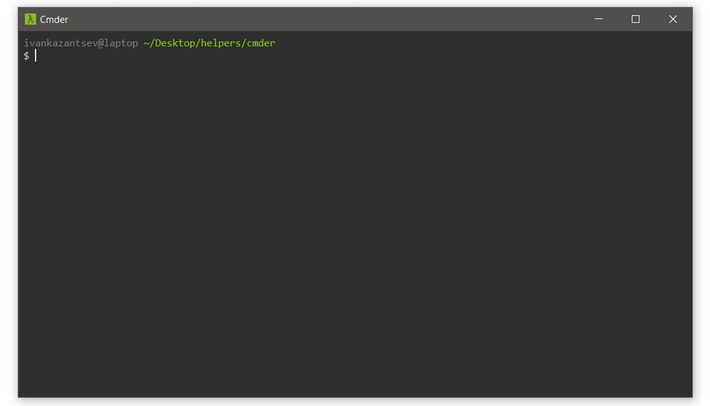

# Настраиваем Cmder 

[Забираем](http://cmder.net) и устанавливаем консоль.

------------------------------------------

## Bash при запуске

`Show system menu > Settings > Startup`, из списка `Specified named task` выбираем `{bash::bash}`.

------------------------------------------

## Папка при запуске

`Show system menu > Settings > Startup > Tasks`, выбираем `{bash::bash}` и нажимаем `Startup dir`.

------------------------------------------

## Кодировка для кириллицы
`Show system menu > Settings > Startup > Environment` и добавляем в конец:

```
set LC_ALL=ru_RU.UTF-8
set LANG=ru_RU.UTF-8
```

------------------------------------------

## Сплит экрана

> В одной консоли запускаю сборщик, в другой работаю.

Установим хоткей:

`Show system menu > Settings > Startup > Keys & Macro` и находим `Split: Duplicate active ‘shell’ split to right`.

------------------------------------------

## Наведем красоту

Ведь в красивой консоли работать приятней.

------------------------------------------

## Поменяем цвета

`Show system menu > Settings > Features > Colors`

Так-так, какие же цветам нам нужны...

* **0** - цвет бэкграунда | `#282828`
* **2** - цвет имени пользователя и ПК | `#7c7c7c`
* **6/3** - цвет пути | `#8dd006`

-------------------------------------------

## Скроем Tab Bar

1. Назначим хоткей для его открытия:

`Show system menu > Settings > Startup > Keys & Macro` и находим `Show tab bar`.

2. Теперь скроем:

`Show system menu > Settings > General > Tab bar` и выбираем `Don't show`.

----------------------------------

## Самое главное - поменяем λ на $

Ага, вот в этих файлах:

```
cmder\vendor\clink.lua
cmder\vendor\profile.ps1
cmder\vendor\git-for-windows\etc\profile.d\git-prompt.sh
```
