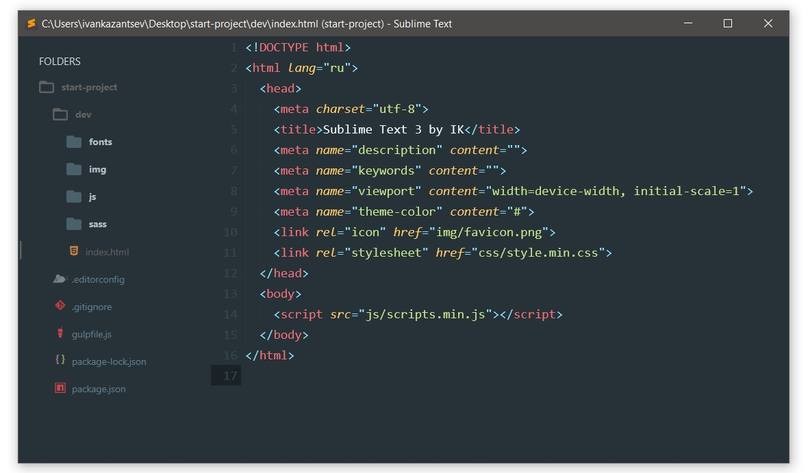

# Настраиваем Sublime Text 3

[Забираем](http://www.sublimetext.com/3) и устанавливаем редактор.

------------------------------------------

## Package Control

1. Для установки пакетов устанавливаем установщик пакетов. Ага.

    * `ctrl + shift + p` и вводим `Install Package Control`.

2. Теперь для установки пакетов будем использовать:

    * `ctrl + shift + p > Package Control: Install Package`.

------------------------------------------

### Минимум

* **Emmet** - допинг в скорости написания кода
* **Sass** или **Less** - добавляем синтаксис препроцессоров
* **EditorConfig** - учит редактор понимать `.editorconfig`
* **BufferScroll** - запоминает положение курсора

Последний плагин в установщике не найдем, поэтому будем ставить вручную.

1. [Забираем с GitHub](https://github.com/titoBouzout/BufferScroll) (нажимаем `Clone or download > Download ZIP`).
2. В **меню** Sublime Text 3 переходим в `Preferences > Browse Packages`.
3. Распаковываем скаченный архив.

------------------------------------------

### Наведем красоту

* **Material Theme** - совсем другое дело 
  * тема не будет работать после установки, включим ее позже

* **A File Icon** - пак иконок для сайдбара

------------------------------------------

## Финальные настройки

`Preferences > Settings`, в правой колонке `User` вставляем [текст](https://gist.github.com/ivan1kazantsev/a9d9936b9023e979ce75c4cae94e65bb).

------------------------------------------

Также можно посмотреть другие варианты **Material Theme**:

`Preferences > Package Settings > Material Theme > Active`
